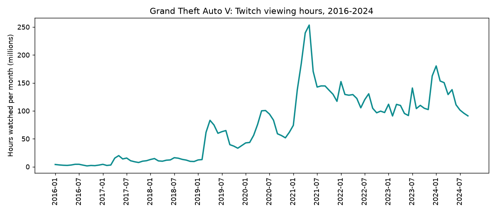
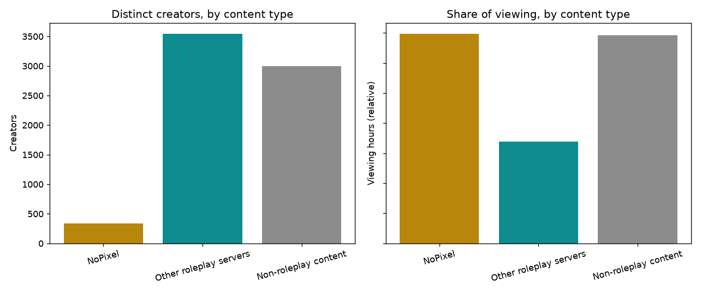
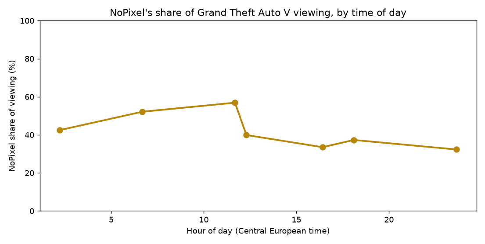

## Executive summary

Grand Theft Auto V is one of Twitch's largest and most durable content categories, and a large share of its audience is watching roleplay content rather than the base game. Within that roleplay audience, a single server — NoPixel — punches far above its weight: a small fraction of the creators account for roughly as much viewing as everything else in the category combined.

<strong>Key finding.</strong> NoPixel's audience share appears to follow a daily cycle tied to time zone, not a sustained growth trend. A reading built from measurements taken only in the early-morning European hours initially looked like a steady climb; a single additional measurement taken during the European evening contradicted that outright. This is presented here as the corrected, honest picture, not the first impression.

## A durable, growing category

Grand Theft Auto V's Twitch audience has grown through several distinct step-changes since 2016 and has not meaningfully declined since its 2021 peak (Figure 1) — unusual durability compared with many competitive titles, which typically show a rise, a peak, and a gradual decline.

*Figure 1. Grand Theft Auto V's monthly Twitch viewing hours, 2016 to 2024.*

Separately, Grand Theft Auto VI already has its own dedicated category on Twitch, created well ahead of the game's release — a category with no content in it yet, but one now available to monitor as soon as real activity begins.

## Roleplay is the majority of the category, and NoPixel dominates within it

Splitting the category into three groups — NoPixel specifically, every other named roleplay server, and everything else — reveals a striking imbalance (Figure 2).

*Figure 2. Left: number of distinct creators by content type. Right: relative share of total viewing by content type.*

NoPixel accounts for fewer than 5% of the category's creators, yet draws roughly as much total viewing as the entire non-roleplay remainder of the category. The hundreds of other named roleplay servers, despite having by far the largest number of creators, together draw noticeably less viewing than NoPixel alone. This is a genuinely unusual concentration: a handful of creators on one server outperforming a much larger, more distributed ecosystem of alternatives.

Language tells a related story. NoPixel's audience is almost entirely English-speaking. The broader roleplay ecosystem, by contrast, carries substantial French, German, Portuguese, and Russian-speaking communities — the platform's linguistic diversity within Grand Theft Auto V lives almost entirely outside NoPixel, not within it.

## A cycle, not a trend

The first pass at measuring NoPixel's share of the category's viewing looked like a steady climb — but every one of those early measurements happened to fall in the same few-hour window of the European morning. A further measurement taken during European evening prime time came back sharply lower, contradicting a "climbing" interpretation outright.

*Figure 3. NoPixel's share of Grand Theft Auto V viewing, plotted by time of day rather than by order of measurement.*

Re-plotted by time of day rather than sequence, the actual shape is a cycle: NoPixel's share peaks in the European morning-to-midday window — corresponding to evening and nighttime in NoPixel's largely North American and UK audience — and falls through the European afternoon and evening as a broader, more internationally distributed audience comes online. A single day of measurement is not enough to confirm this as a settled daily pattern, but it is a far better-supported explanation than a genuine growth trend, and it is a useful caution against reading any single measurement, or a short run of measurements taken close together, as a trend.

## Bottom line

Grand Theft Auto V remains one of Twitch's largest and most durable categories, with roleplay content — not the base game — making up the majority of its audience. Within that roleplay audience, NoPixel is dramatically overrepresented relative to its creator count, drawing viewing on par with the rest of the category's roleplay ecosystem combined despite a tiny fraction of the creators. Its measured share of attention varies considerably by time of day, and any single reading of that share should be treated as a snapshot of a cycle, not a fixed figure.

## Sources

- **Live viewership.** Twitch's own public API, polled repeatedly over time to build a record of concurrent viewers, channel counts, stream titles, tags, and language by category — including the specific same-day morning and evening measurements behind the time-of-day finding in this report.
- **Historical trend.** A published historical dataset of Twitch category viewing hours, covering 2016 through 2024, used for the long-run trend in Figure 1.
- **Content classification (roleplay server, NoPixel, or neither).** Determined from each stream's own title and tags at the time it was live, using a fixed set of matching rules rather than manual review or guesswork.
