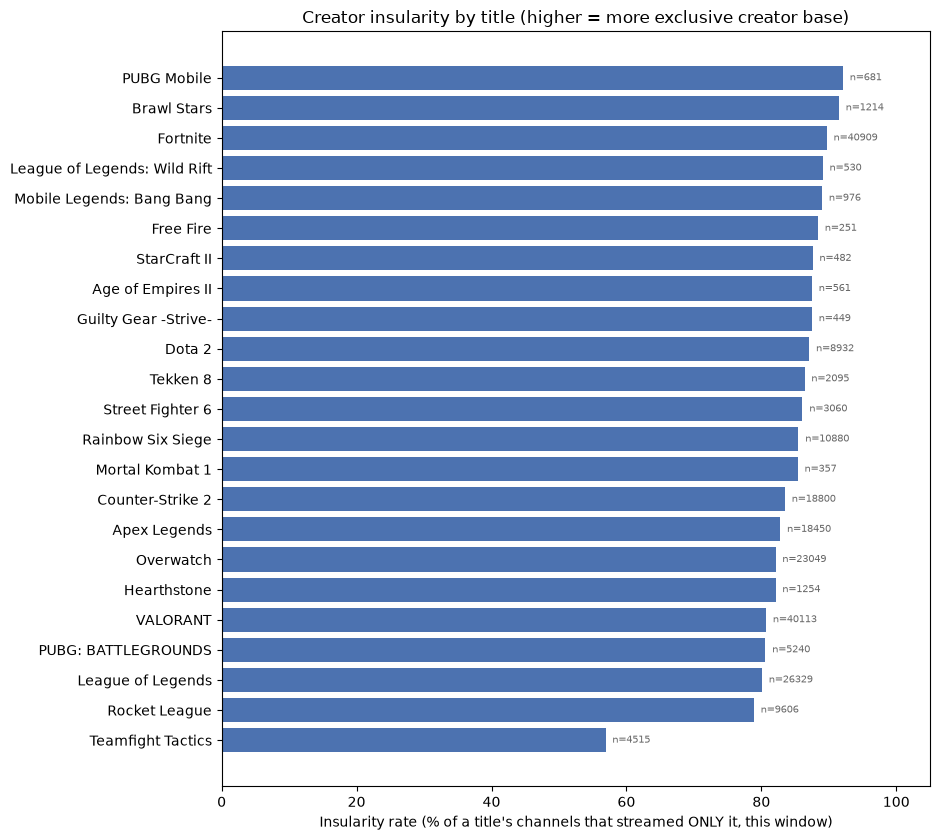
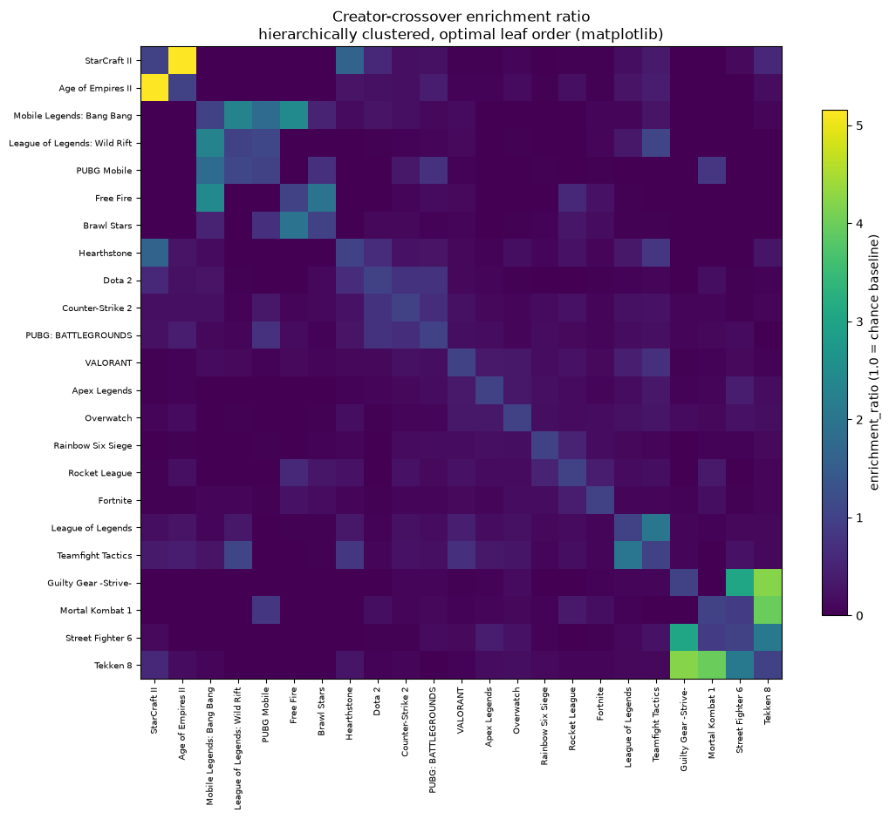

This is a snapshot of two pieces of work in progress from an independent research project tracking audience and creator-ecosystem behavior across 23 competitive-gaming titles, combining self-collected live Twitch measurement with Liquipedia's own tournament records. Sharing it now, alongside the access request for the titles above, as a concrete example of the kind of question this data is being used to answer.

Both pieces below cover a single, fairly short measurement window (a few days to two weeks), and are shown here as directional early findings, not settled conclusions &mdash; the honest caveats are kept in, not smoothed over.

## Do creators specialize, or cross over between titles?

Across all 23 tracked titles, creators overwhelmingly stick to one title. Even the title with the most crossover in this window &mdash; Teamfight Tactics, at 56.9% &mdash; still saw a majority of its creators stream nothing else above a basic viewership threshold. Most titles sit far higher: several mobile and strategy titles show 87&ndash;92% of their creators exclusive to that one title alone.

*Distinct creators per title who streamed only that title, this window (raw creator counts shown alongside each bar).*

Raw overlap counts are misleading on their own &mdash; two very large titles will share a lot of creators purely because both pools are enormous, without any real affinity implied. So every pair below is also scored against what two titles of their specific sizes would share by pure chance (an enrichment ratio: 1.0&times; means exactly the chance level, higher means creators are moving between these two titles more than random chance would predict).

*Every title-pair's enrichment ratio, titles reordered so similar pairs sit near each other. Two clear blocks stand out: the fighting-game titles, and the mobile MOBA/battle-royale titles &mdash; both far more internally connected than anything else in the set.*

The full pairwise table below (190 title pairs with at least one shared creator this window) is sorted by enrichment ratio, highest first:

<table class="data-table">
<thead><tr><th>Title A</th><th>Title B</th><th>Shared creators</th><th>Enrichment (&times; chance)</th><th>% of A's creators also on B</th><th>% of B's creators also on A</th></tr></thead>
<tbody>
<tr><td>Age of Empires II</td><td>StarCraft II</td><td>7</td><td>5.16&times;</td><td>1.2%</td><td>1.5%</td></tr>
<tr><td>Guilty Gear -Strive-</td><td>Tekken 8</td><td>20</td><td>4.23&times;</td><td>4.5%</td><td>1.0%</td></tr>
<tr><td>Mortal Kombat 1</td><td>Tekken 8</td><td>15</td><td>3.99&times;</td><td>4.2%</td><td>0.7%</td></tr>
<tr><td>Guilty Gear -Strive-</td><td>Street Fighter 6</td><td>21</td><td>3.04&times;</td><td>4.7%</td><td>0.7%</td></tr>
<tr><td>Free Fire</td><td>Mobile Legends: Bang Bang</td><td>3</td><td>2.44&times;</td><td>1.2%</td><td>0.3%</td></tr>
<tr><td>Mobile Legends: Bang Bang</td><td>League of Legends: Wild Rift</td><td>6</td><td>2.31&times;</td><td>0.6%</td><td>1.1%</td></tr>
<tr><td>Street Fighter 6</td><td>Tekken 8</td><td>67</td><td>2.08&times;</td><td>2.2%</td><td>3.2%</td></tr>
<tr><td>League of Legends</td><td>Teamfight Tactics</td><td>1212</td><td>2.03&times;</td><td>4.6%</td><td>26.8%</td></tr>
<tr><td>Brawl Stars</td><td>Free Fire</td><td>3</td><td>1.96&times;</td><td>0.2%</td><td>1.2%</td></tr>
<tr><td>Mobile Legends: Bang Bang</td><td>PUBG Mobile</td><td>6</td><td>1.80&times;</td><td>0.6%</td><td>0.9%</td></tr>
<tr><td>Hearthstone</td><td>StarCraft II</td><td>5</td><td>1.65&times;</td><td>0.4%</td><td>1.0%</td></tr>
<tr><td>PUBG Mobile</td><td>League of Legends: Wild Rift</td><td>2</td><td>1.10&times;</td><td>0.3%</td><td>0.4%</td></tr>
<tr><td>Teamfight Tactics</td><td>League of Legends: Wild Rift</td><td>13</td><td>1.08&times;</td><td>0.3%</td><td>2.5%</td></tr>
<tr><td>Mortal Kombat 1</td><td>Street Fighter 6</td><td>5</td><td>0.91&times;</td><td>1.4%</td><td>0.2%</td></tr>
<tr><td>Mortal Kombat 1</td><td>PUBG Mobile</td><td>1</td><td>0.82&times;</td><td>0.3%</td><td>0.1%</td></tr>
<tr><td>Hearthstone</td><td>Teamfight Tactics</td><td>23</td><td>0.81&times;</td><td>1.8%</td><td>0.5%</td></tr>
<tr><td>Dota 2</td><td>PUBG: BATTLEGROUNDS</td><td>176</td><td>0.75&times;</td><td>2.0%</td><td>3.4%</td></tr>
<tr><td>Counter-Strike 2</td><td>Dota 2</td><td>632</td><td>0.75&times;</td><td>3.4%</td><td>7.1%</td></tr>
<tr><td>PUBG: BATTLEGROUNDS</td><td>PUBG Mobile</td><td>13</td><td>0.73&times;</td><td>0.2%</td><td>1.9%</td></tr>
<tr><td>Brawl Stars</td><td>PUBG Mobile</td><td>3</td><td>0.72&times;</td><td>0.2%</td><td>0.4%</td></tr>
<tr><td>Teamfight Tactics</td><td>VALORANT</td><td>627</td><td>0.69&times;</td><td>13.9%</td><td>1.6%</td></tr>
<tr><td>Counter-Strike 2</td><td>PUBG: BATTLEGROUNDS</td><td>338</td><td>0.68&times;</td><td>1.8%</td><td>6.5%</td></tr>
<tr><td>Dota 2</td><td>Hearthstone</td><td>37</td><td>0.66&times;</td><td>0.4%</td><td>3.0%</td></tr>
<tr><td>Dota 2</td><td>StarCraft II</td><td>13</td><td>0.60&times;</td><td>0.1%</td><td>2.7%</td></tr>
<tr><td>StarCraft II</td><td>Tekken 8</td><td>3</td><td>0.59&times;</td><td>0.6%</td><td>0.1%</td></tr>
<tr><td>Free Fire</td><td>Rocket League</td><td>7</td><td>0.58&times;</td><td>2.8%</td><td>0.1%</td></tr>
<tr><td>Rainbow Six Siege</td><td>Rocket League</td><td>261</td><td>0.50&times;</td><td>2.4%</td><td>2.7%</td></tr>
<tr><td>Brawl Stars</td><td>Mobile Legends: Bang Bang</td><td>3</td><td>0.50&times;</td><td>0.2%</td><td>0.3%</td></tr>
<tr><td>League of Legends</td><td>VALORANT</td><td>2266</td><td>0.43&times;</td><td>8.6%</td><td>5.6%</td></tr>
<tr><td>Age of Empires II</td><td>PUBG: BATTLEGROUNDS</td><td>6</td><td>0.41&times;</td><td>1.1%</td><td>0.1%</td></tr>
<tr><td>Fortnite</td><td>Rocket League</td><td>796</td><td>0.40&times;</td><td>1.9%</td><td>8.3%</td></tr>
<tr><td>Apex Legends</td><td>Street Fighter 6</td><td>110</td><td>0.39&times;</td><td>0.6%</td><td>3.6%</td></tr>
<tr><td>Age of Empires II</td><td>Teamfight Tactics</td><td>5</td><td>0.39&times;</td><td>0.9%</td><td>0.1%</td></tr>
<tr><td>StarCraft II</td><td>Teamfight Tactics</td><td>4</td><td>0.37&times;</td><td>0.8%</td><td>0.1%</td></tr>
<tr><td>Mortal Kombat 1</td><td>Rocket League</td><td>6</td><td>0.35&times;</td><td>1.7%</td><td>0.1%</td></tr>
<tr><td>Apex Legends</td><td>VALORANT</td><td>1288</td><td>0.35&times;</td><td>7.0%</td><td>3.2%</td></tr>
<tr><td>Hearthstone</td><td>League of Legends</td><td>57</td><td>0.34&times;</td><td>4.5%</td><td>0.2%</td></tr>
<tr><td>Apex Legends</td><td>Teamfight Tactics</td><td>142</td><td>0.34&times;</td><td>0.8%</td><td>3.1%</td></tr>
<tr><td>Apex Legends</td><td>Overwatch</td><td>721</td><td>0.34&times;</td><td>3.9%</td><td>3.1%</td></tr>
<tr><td>Counter-Strike 2</td><td>PUBG Mobile</td><td>21</td><td>0.33&times;</td><td>0.1%</td><td>3.1%</td></tr>
<tr><td>Overwatch</td><td>VALORANT</td><td>1525</td><td>0.33&times;</td><td>6.6%</td><td>3.8%</td></tr>
<tr><td>League of Legends</td><td>League of Legends: Wild Rift</td><td>23</td><td>0.33&times;</td><td>0.1%</td><td>4.3%</td></tr>
<tr><td>Brawl Stars</td><td>Rocket League</td><td>18</td><td>0.31&times;</td><td>1.5%</td><td>0.2%</td></tr>
<tr><td>Overwatch</td><td>Teamfight Tactics</td><td>158</td><td>0.30&times;</td><td>0.7%</td><td>3.5%</td></tr>
<tr><td>Hearthstone</td><td>Tekken 8</td><td>4</td><td>0.30&times;</td><td>0.3%</td><td>0.2%</td></tr>
<tr><td>Age of Empires II</td><td>League of Legends</td><td>21</td><td>0.28&times;</td><td>3.7%</td><td>0.1%</td></tr>
<tr><td>Age of Empires II</td><td>Hearthstone</td><td>1</td><td>0.28&times;</td><td>0.2%</td><td>0.1%</td></tr>
<tr><td>Mobile Legends: Bang Bang</td><td>Teamfight Tactics</td><td>6</td><td>0.27&times;</td><td>0.6%</td><td>0.1%</td></tr>
<tr><td>Dota 2</td><td>Mobile Legends: Bang Bang</td><td>12</td><td>0.27&times;</td><td>0.1%</td><td>1.2%</td></tr>
<tr><td>Hearthstone</td><td>PUBG: BATTLEGROUNDS</td><td>9</td><td>0.27&times;</td><td>0.7%</td><td>0.2%</td></tr>
<tr><td>Street Fighter 6</td><td>Teamfight Tactics</td><td>18</td><td>0.26&times;</td><td>0.6%</td><td>0.4%</td></tr>
<tr><td>Overwatch</td><td>Street Fighter 6</td><td>92</td><td>0.26&times;</td><td>0.4%</td><td>3.0%</td></tr>
<tr><td>Counter-Strike 2</td><td>Teamfight Tactics</td><td>110</td><td>0.26&times;</td><td>0.6%</td><td>2.4%</td></tr>
<tr><td>Rocket League</td><td>VALORANT</td><td>509</td><td>0.26&times;</td><td>5.3%</td><td>1.3%</td></tr>
<tr><td>Counter-Strike 2</td><td>Rocket League</td><td>224</td><td>0.25&times;</td><td>1.2%</td><td>2.3%</td></tr>
<tr><td>Counter-Strike 2</td><td>Hearthstone</td><td>30</td><td>0.25&times;</td><td>0.2%</td><td>2.4%</td></tr>
<tr><td>Hearthstone</td><td>Rocket League</td><td>15</td><td>0.25&times;</td><td>1.2%</td><td>0.2%</td></tr>
<tr><td>Fortnite</td><td>Free Fire</td><td>13</td><td>0.25&times;</td><td>0.0%</td><td>5.2%</td></tr>
<tr><td>PUBG: BATTLEGROUNDS</td><td>StarCraft II</td><td>3</td><td>0.24&times;</td><td>0.1%</td><td>0.6%</td></tr>
<tr><td>Age of Empires II</td><td>Dota 2</td><td>6</td><td>0.24&times;</td><td>1.1%</td><td>0.1%</td></tr>
<tr><td>League of Legends</td><td>Overwatch</td><td>691</td><td>0.23&times;</td><td>2.6%</td><td>3.0%</td></tr>
<tr><td>Counter-Strike 2</td><td>League of Legends</td><td>570</td><td>0.23&times;</td><td>3.0%</td><td>2.2%</td></tr>
<tr><td>Counter-Strike 2</td><td>VALORANT</td><td>873</td><td>0.23&times;</td><td>4.6%</td><td>2.2%</td></tr>
<tr><td>Counter-Strike 2</td><td>StarCraft II</td><td>10</td><td>0.22&times;</td><td>0.1%</td><td>2.1%</td></tr>
<tr><td>Age of Empires II</td><td>Rocket League</td><td>6</td><td>0.22&times;</td><td>1.1%</td><td>0.1%</td></tr>
<tr><td>PUBG: BATTLEGROUNDS</td><td>Teamfight Tactics</td><td>26</td><td>0.22&times;</td><td>0.5%</td><td>0.6%</td></tr>
<tr><td>Counter-Strike 2</td><td>Mobile Legends: Bang Bang</td><td>20</td><td>0.22&times;</td><td>0.1%</td><td>2.0%</td></tr>
<tr><td>Apex Legends</td><td>Rainbow Six Siege</td><td>219</td><td>0.22&times;</td><td>1.2%</td><td>2.0%</td></tr>
<tr><td>Age of Empires II</td><td>Counter-Strike 2</td><td>11</td><td>0.21&times;</td><td>2.0%</td><td>0.1%</td></tr>
<tr><td>PUBG: BATTLEGROUNDS</td><td>VALORANT</td><td>211</td><td>0.20&times;</td><td>4.0%</td><td>0.5%</td></tr>
<tr><td>Overwatch</td><td>Rainbow Six Siege</td><td>248</td><td>0.20&times;</td><td>1.1%</td><td>2.3%</td></tr>
<tr><td>Hearthstone</td><td>Overwatch</td><td>29</td><td>0.20&times;</td><td>2.3%</td><td>0.1%</td></tr>
<tr><td>League of Legends</td><td>StarCraft II</td><td>13</td><td>0.20&times;</td><td>0.0%</td><td>2.7%</td></tr>
<tr><td>Dota 2</td><td>Mortal Kombat 1</td><td>3</td><td>0.19&times;</td><td>0.0%</td><td>0.8%</td></tr>
<tr><td>Rocket League</td><td>Teamfight Tactics</td><td>42</td><td>0.19&times;</td><td>0.4%</td><td>0.9%</td></tr>
<tr><td>Fortnite</td><td>Mortal Kombat 1</td><td>14</td><td>0.19&times;</td><td>0.0%</td><td>3.9%</td></tr>
<tr><td>Overwatch</td><td>Tekken 8</td><td>46</td><td>0.19&times;</td><td>0.2%</td><td>2.2%</td></tr>
<tr><td>Apex Legends</td><td>PUBG: BATTLEGROUNDS</td><td>86</td><td>0.18&times;</td><td>0.5%</td><td>1.6%</td></tr>
<tr><td>League of Legends</td><td>PUBG: BATTLEGROUNDS</td><td>126</td><td>0.18&times;</td><td>0.5%</td><td>2.4%</td></tr>
<tr><td>Fortnite</td><td>Overwatch</td><td>873</td><td>0.18&times;</td><td>2.1%</td><td>3.8%</td></tr>
<tr><td>Fortnite</td><td>Rainbow Six Siege</td><td>409</td><td>0.18&times;</td><td>1.0%</td><td>3.8%</td></tr>
<tr><td>Apex Legends</td><td>Tekken 8</td><td>34</td><td>0.18&times;</td><td>0.2%</td><td>1.6%</td></tr>
<tr><td>Rainbow Six Siege</td><td>VALORANT</td><td>368</td><td>0.17&times;</td><td>3.4%</td><td>0.9%</td></tr>
<tr><td>PUBG: BATTLEGROUNDS</td><td>Rainbow Six Siege</td><td>49</td><td>0.17&times;</td><td>0.9%</td><td>0.5%</td></tr>
<tr><td>Age of Empires II</td><td>Tekken 8</td><td>1</td><td>0.17&times;</td><td>0.2%</td><td>0.0%</td></tr>
<tr><td>Brawl Stars</td><td>Fortnite</td><td>43</td><td>0.17&times;</td><td>3.5%</td><td>0.1%</td></tr>
<tr><td>Apex Legends</td><td>League of Legends</td><td>420</td><td>0.17&times;</td><td>2.3%</td><td>1.6%</td></tr>
<tr><td>Mobile Legends: Bang Bang</td><td>VALORANT</td><td>31</td><td>0.16&times;</td><td>3.2%</td><td>0.1%</td></tr>
<tr><td>Overwatch</td><td>Rocket League</td><td>177</td><td>0.16&times;</td><td>0.8%</td><td>1.8%</td></tr>
<tr><td>Hearthstone</td><td>Mobile Legends: Bang Bang</td><td>1</td><td>0.16&times;</td><td>0.1%</td><td>0.1%</td></tr>
<tr><td>Apex Legends</td><td>Rocket League</td><td>145</td><td>0.16&times;</td><td>0.8%</td><td>1.5%</td></tr>
<tr><td>Guilty Gear -Strive-</td><td>Overwatch</td><td>8</td><td>0.15&times;</td><td>1.8%</td><td>0.0%</td></tr>
<tr><td>PUBG: BATTLEGROUNDS</td><td>Street Fighter 6</td><td>12</td><td>0.15&times;</td><td>0.2%</td><td>0.4%</td></tr>
<tr><td>League of Legends</td><td>Rocket League</td><td>186</td><td>0.15&times;</td><td>0.7%</td><td>1.9%</td></tr>
<tr><td>Free Fire</td><td>PUBG: BATTLEGROUNDS</td><td>1</td><td>0.15&times;</td><td>0.4%</td><td>0.0%</td></tr>
<tr><td>Counter-Strike 2</td><td>Rainbow Six Siege</td><td>156</td><td>0.15&times;</td><td>0.8%</td><td>1.4%</td></tr>
<tr><td>Age of Empires II</td><td>Overwatch</td><td>10</td><td>0.15&times;</td><td>1.8%</td><td>0.0%</td></tr>
<tr><td>Fortnite</td><td>VALORANT</td><td>1190</td><td>0.14&times;</td><td>2.9%</td><td>3.0%</td></tr>
<tr><td>Free Fire</td><td>VALORANT</td><td>7</td><td>0.14&times;</td><td>2.8%</td><td>0.0%</td></tr>
<tr><td>Rainbow Six Siege</td><td>Tekken 8</td><td>16</td><td>0.14&times;</td><td>0.1%</td><td>0.8%</td></tr>
<tr><td>StarCraft II</td><td>Street Fighter 6</td><td>1</td><td>0.14&times;</td><td>0.2%</td><td>0.0%</td></tr>
<tr><td>PUBG: BATTLEGROUNDS</td><td>Rocket League</td><td>33</td><td>0.13&times;</td><td>0.6%</td><td>0.3%</td></tr>
<tr><td>Street Fighter 6</td><td>VALORANT</td><td>82</td><td>0.13&times;</td><td>2.7%</td><td>0.2%</td></tr>
<tr><td>VALORANT</td><td>League of Legends: Wild Rift</td><td>14</td><td>0.13&times;</td><td>0.0%</td><td>2.6%</td></tr>
<tr><td>Mobile Legends: Bang Bang</td><td>PUBG: BATTLEGROUNDS</td><td>3</td><td>0.12&times;</td><td>0.3%</td><td>0.1%</td></tr>
<tr><td>Mortal Kombat 1</td><td>Overwatch</td><td>5</td><td>0.12&times;</td><td>1.4%</td><td>0.0%</td></tr>
<tr><td>Apex Legends</td><td>Counter-Strike 2</td><td>212</td><td>0.12&times;</td><td>1.1%</td><td>1.1%</td></tr>
<tr><td>League of Legends</td><td>Tekken 8</td><td>32</td><td>0.12&times;</td><td>0.1%</td><td>1.5%</td></tr>
<tr><td>League of Legends</td><td>Street Fighter 6</td><td>44</td><td>0.11&times;</td><td>0.2%</td><td>1.4%</td></tr>
<tr><td>Brawl Stars</td><td>Counter-Strike 2</td><td>13</td><td>0.11&times;</td><td>1.1%</td><td>0.1%</td></tr>
<tr><td>Mortal Kombat 1</td><td>PUBG: BATTLEGROUNDS</td><td>1</td><td>0.11&times;</td><td>0.3%</td><td>0.0%</td></tr>
<tr><td>Dota 2</td><td>VALORANT</td><td>201</td><td>0.11&times;</td><td>2.3%</td><td>0.5%</td></tr>
<tr><td>League of Legends</td><td>Rainbow Six Siege</td><td>154</td><td>0.11&times;</td><td>0.6%</td><td>1.4%</td></tr>
<tr><td>Brawl Stars</td><td>Dota 2</td><td>6</td><td>0.11&times;</td><td>0.5%</td><td>0.1%</td></tr>
<tr><td>Teamfight Tactics</td><td>Tekken 8</td><td>5</td><td>0.11&times;</td><td>0.1%</td><td>0.2%</td></tr>
<tr><td>Hearthstone</td><td>VALORANT</td><td>27</td><td>0.11&times;</td><td>2.2%</td><td>0.1%</td></tr>
<tr><td>Fortnite</td><td>League of Legends</td><td>517</td><td>0.10&times;</td><td>1.3%</td><td>2.0%</td></tr>
<tr><td>Fortnite</td><td>Tekken 8</td><td>43</td><td>0.10&times;</td><td>0.1%</td><td>2.1%</td></tr>
<tr><td>Mobile Legends: Bang Bang</td><td>Tekken 8</td><td>1</td><td>0.10&times;</td><td>0.1%</td><td>0.0%</td></tr>
<tr><td>Guilty Gear -Strive-</td><td>Teamfight Tactics</td><td>1</td><td>0.10&times;</td><td>0.2%</td><td>0.0%</td></tr>
<tr><td>Rocket League</td><td>Tekken 8</td><td>10</td><td>0.10&times;</td><td>0.1%</td><td>0.5%</td></tr>
<tr><td>Apex Legends</td><td>Fortnite</td><td>388</td><td>0.10&times;</td><td>2.1%</td><td>0.9%</td></tr>
<tr><td>Counter-Strike 2</td><td>Overwatch</td><td>210</td><td>0.10&times;</td><td>1.1%</td><td>0.9%</td></tr>
<tr><td>Overwatch</td><td>PUBG: BATTLEGROUNDS</td><td>53</td><td>0.09&times;</td><td>0.2%</td><td>1.0%</td></tr>
<tr><td>Fortnite</td><td>Mobile Legends: Bang Bang</td><td>19</td><td>0.09&times;</td><td>0.0%</td><td>1.9%</td></tr>
<tr><td>Fortnite</td><td>PUBG: BATTLEGROUNDS</td><td>94</td><td>0.09&times;</td><td>0.2%</td><td>1.8%</td></tr>
<tr><td>Counter-Strike 2</td><td>Mortal Kombat 1</td><td>3</td><td>0.09&times;</td><td>0.0%</td><td>0.8%</td></tr>
<tr><td>Apex Legends</td><td>Mortal Kombat 1</td><td>3</td><td>0.09&times;</td><td>0.0%</td><td>0.8%</td></tr>
<tr><td>Counter-Strike 2</td><td>Fortnite</td><td>336</td><td>0.09&times;</td><td>1.8%</td><td>0.8%</td></tr>
<tr><td>Fortnite</td><td>Hearthstone</td><td>22</td><td>0.09&times;</td><td>0.1%</td><td>1.8%</td></tr>
<tr><td>Fortnite</td><td>Teamfight Tactics</td><td>85</td><td>0.09&times;</td><td>0.2%</td><td>1.9%</td></tr>
<tr><td>Guilty Gear -Strive-</td><td>PUBG: BATTLEGROUNDS</td><td>1</td><td>0.08&times;</td><td>0.2%</td><td>0.0%</td></tr>
<tr><td>Guilty Gear -Strive-</td><td>League of Legends</td><td>5</td><td>0.08&times;</td><td>1.1%</td><td>0.0%</td></tr>
<tr><td>Rainbow Six Siege</td><td>Teamfight Tactics</td><td>20</td><td>0.08&times;</td><td>0.2%</td><td>0.4%</td></tr>
<tr><td>Dota 2</td><td>Teamfight Tactics</td><td>17</td><td>0.08&times;</td><td>0.2%</td><td>0.4%</td></tr>
<tr><td>League of Legends</td><td>Mobile Legends: Bang Bang</td><td>10</td><td>0.08&times;</td><td>0.0%</td><td>1.0%</td></tr>
<tr><td>Counter-Strike 2</td><td>Free Fire</td><td>2</td><td>0.08&times;</td><td>0.0%</td><td>0.8%</td></tr>
<tr><td>PUBG: BATTLEGROUNDS</td><td>League of Legends: Wild Rift</td><td>1</td><td>0.07&times;</td><td>0.0%</td><td>0.2%</td></tr>
<tr><td>Counter-Strike 2</td><td>Guilty Gear -Strive-</td><td>3</td><td>0.07&times;</td><td>0.0%</td><td>0.7%</td></tr>
<tr><td>Hearthstone</td><td>Rainbow Six Siege</td><td>5</td><td>0.07&times;</td><td>0.4%</td><td>0.0%</td></tr>
<tr><td>Apex Legends</td><td>Dota 2</td><td>55</td><td>0.07&times;</td><td>0.3%</td><td>0.6%</td></tr>
<tr><td>Brawl Stars</td><td>VALORANT</td><td>17</td><td>0.07&times;</td><td>1.4%</td><td>0.0%</td></tr>
<tr><td>Overwatch</td><td>StarCraft II</td><td>4</td><td>0.07&times;</td><td>0.0%</td><td>0.8%</td></tr>
<tr><td>Counter-Strike 2</td><td>Tekken 8</td><td>14</td><td>0.07&times;</td><td>0.1%</td><td>0.7%</td></tr>
<tr><td>Fortnite</td><td>League of Legends: Wild Rift</td><td>8</td><td>0.07&times;</td><td>0.0%</td><td>1.5%</td></tr>
<tr><td>Age of Empires II</td><td>VALORANT</td><td>7</td><td>0.06&times;</td><td>1.2%</td><td>0.0%</td></tr>
<tr><td>Apex Legends</td><td>Hearthstone</td><td>7</td><td>0.06&times;</td><td>0.0%</td><td>0.6%</td></tr>
<tr><td>PUBG Mobile</td><td>VALORANT</td><td>8</td><td>0.06&times;</td><td>1.2%</td><td>0.0%</td></tr>
<tr><td>Mortal Kombat 1</td><td>VALORANT</td><td>4</td><td>0.06&times;</td><td>1.1%</td><td>0.0%</td></tr>
<tr><td>Brawl Stars</td><td>PUBG: BATTLEGROUNDS</td><td>2</td><td>0.06&times;</td><td>0.2%</td><td>0.0%</td></tr>
<tr><td>League of Legends</td><td>Mortal Kombat 1</td><td>3</td><td>0.06&times;</td><td>0.0%</td><td>0.8%</td></tr>
<tr><td>Counter-Strike 2</td><td>League of Legends: Wild Rift</td><td>3</td><td>0.06&times;</td><td>0.0%</td><td>0.6%</td></tr>
<tr><td>Age of Empires II</td><td>Apex Legends</td><td>3</td><td>0.06&times;</td><td>0.5%</td><td>0.0%</td></tr>
<tr><td>Tekken 8</td><td>VALORANT</td><td>22</td><td>0.05&times;</td><td>1.1%</td><td>0.1%</td></tr>
<tr><td>Dota 2</td><td>League of Legends</td><td>58</td><td>0.05&times;</td><td>0.6%</td><td>0.2%</td></tr>
<tr><td>Apex Legends</td><td>Guilty Gear -Strive-</td><td>2</td><td>0.05&times;</td><td>0.0%</td><td>0.4%</td></tr>
<tr><td>Mortal Kombat 1</td><td>Rainbow Six Siege</td><td>1</td><td>0.05&times;</td><td>0.3%</td><td>0.0%</td></tr>
<tr><td>Fortnite</td><td>Guilty Gear -Strive-</td><td>5</td><td>0.05&times;</td><td>0.0%</td><td>1.1%</td></tr>
<tr><td>Dota 2</td><td>Tekken 8</td><td>5</td><td>0.05&times;</td><td>0.1%</td><td>0.2%</td></tr>
<tr><td>Rainbow Six Siege</td><td>Street Fighter 6</td><td>8</td><td>0.05&times;</td><td>0.1%</td><td>0.3%</td></tr>
<tr><td>Brawl Stars</td><td>Rainbow Six Siege</td><td>3</td><td>0.05&times;</td><td>0.2%</td><td>0.0%</td></tr>
<tr><td>Counter-Strike 2</td><td>Street Fighter 6</td><td>11</td><td>0.04&times;</td><td>0.1%</td><td>0.4%</td></tr>
<tr><td>Rocket League</td><td>StarCraft II</td><td>1</td><td>0.04&times;</td><td>0.0%</td><td>0.2%</td></tr>
<tr><td>Apex Legends</td><td>StarCraft II</td><td>2</td><td>0.04&times;</td><td>0.0%</td><td>0.4%</td></tr>
<tr><td>Brawl Stars</td><td>Teamfight Tactics</td><td>1</td><td>0.04&times;</td><td>0.1%</td><td>0.0%</td></tr>
<tr><td>Dota 2</td><td>Overwatch</td><td>42</td><td>0.04&times;</td><td>0.5%</td><td>0.2%</td></tr>
<tr><td>Brawl Stars</td><td>Overwatch</td><td>6</td><td>0.04&times;</td><td>0.5%</td><td>0.0%</td></tr>
<tr><td>Dota 2</td><td>League of Legends: Wild Rift</td><td>1</td><td>0.04&times;</td><td>0.0%</td><td>0.2%</td></tr>
<tr><td>StarCraft II</td><td>VALORANT</td><td>4</td><td>0.04&times;</td><td>0.8%</td><td>0.0%</td></tr>
<tr><td>Dota 2</td><td>Fortnite</td><td>49</td><td>0.03&times;</td><td>0.5%</td><td>0.1%</td></tr>
<tr><td>Fortnite</td><td>Street Fighter 6</td><td>19</td><td>0.03&times;</td><td>0.0%</td><td>0.6%</td></tr>
<tr><td>Dota 2</td><td>Street Fighter 6</td><td>4</td><td>0.03&times;</td><td>0.0%</td><td>0.1%</td></tr>
<tr><td>Fortnite</td><td>PUBG Mobile</td><td>4</td><td>0.03&times;</td><td>0.0%</td><td>0.6%</td></tr>
<tr><td>Guilty Gear -Strive-</td><td>VALORANT</td><td>3</td><td>0.03&times;</td><td>0.7%</td><td>0.0%</td></tr>
<tr><td>Age of Empires II</td><td>Rainbow Six Siege</td><td>1</td><td>0.03&times;</td><td>0.2%</td><td>0.0%</td></tr>
<tr><td>Brawl Stars</td><td>League of Legends</td><td>5</td><td>0.03&times;</td><td>0.4%</td><td>0.0%</td></tr>
<tr><td>Age of Empires II</td><td>Fortnite</td><td>3</td><td>0.03&times;</td><td>0.5%</td><td>0.0%</td></tr>
<tr><td>Free Fire</td><td>League of Legends</td><td>1</td><td>0.03&times;</td><td>0.4%</td><td>0.0%</td></tr>
<tr><td>PUBG Mobile</td><td>Rainbow Six Siege</td><td>1</td><td>0.03&times;</td><td>0.1%</td><td>0.0%</td></tr>
<tr><td>Overwatch</td><td>League of Legends: Wild Rift</td><td>2</td><td>0.03&times;</td><td>0.0%</td><td>0.4%</td></tr>
<tr><td>Fortnite</td><td>StarCraft II</td><td>3</td><td>0.03&times;</td><td>0.0%</td><td>0.6%</td></tr>
<tr><td>Dota 2</td><td>Rocket League</td><td>8</td><td>0.02&times;</td><td>0.1%</td><td>0.1%</td></tr>
<tr><td>Apex Legends</td><td>League of Legends: Wild Rift</td><td>1</td><td>0.02&times;</td><td>0.0%</td><td>0.2%</td></tr>
<tr><td>Mobile Legends: Bang Bang</td><td>Overwatch</td><td>2</td><td>0.02&times;</td><td>0.2%</td><td>0.0%</td></tr>
<tr><td>Mobile Legends: Bang Bang</td><td>Rainbow Six Siege</td><td>1</td><td>0.02&times;</td><td>0.1%</td><td>0.0%</td></tr>
<tr><td>Apex Legends</td><td>Mobile Legends: Bang Bang</td><td>2</td><td>0.02&times;</td><td>0.0%</td><td>0.2%</td></tr>
<tr><td>Dota 2</td><td>Rainbow Six Siege</td><td>5</td><td>0.01&times;</td><td>0.1%</td><td>0.0%</td></tr>
<tr><td>Rocket League</td><td>Street Fighter 6</td><td>2</td><td>0.01&times;</td><td>0.0%</td><td>0.1%</td></tr>
<tr><td>League of Legends</td><td>PUBG Mobile</td><td>1</td><td>0.01&times;</td><td>0.0%</td><td>0.1%</td></tr>
<tr><td>Apex Legends</td><td>Brawl Stars</td><td>1</td><td>0.01&times;</td><td>0.0%</td><td>0.1%</td></tr>
</tbody></table>

## Do titles that share a genre and platform actually share an audience?

A separate question: when two titles occupy the same competitive niche (same genre, same primary platform), do they draw from the same pool of viewers, or does the audience actually split between them? Measured here via each title's language mix on Twitch &mdash; how similar are two titles' audiences once the one language almost every title has some of (English) is set aside, since it otherwise masks real differences in the rest of the audience.

Thirteen same-niche pairs exist across the 23 tracked titles. Most aren't reliably readable this window, for two different honest reasons: some titles' Twitch creator base is currently too thin to trust (mobile titles, mainly), and some have a live tournament running during this exact measurement window, which pulls their audience's apparent makeup toward that broadcast rather than reflecting the title's normal audience.

Of the pairs that are cleanly readable, one result stands out: Apex Legends and PUBG: BATTLEGROUNDS &mdash; both battle royale titles on PC/console &mdash; show the strongest audience similarity of any clean pair in the table, on two independent measures agreeing with each other. In the same niche, Apex Legends and Fortnite show the opposite: the least similar audience of the entire table. Same genre, same platform, very different audience makeup depending on the specific pair.

<table class="data-table">
<thead><tr><th>Niche (genre / platform)</th><th>Title A</th><th>Title B</th><th>Audience similarity (English-speaking viewers excluded)</th><th>Audience distance</th><th>Read</th></tr></thead>
<tbody>
<tr><td>Battle Royale / Mobile</td><td>Free Fire</td><td>PUBG Mobile</td><td>0.01</td><td>0.92</td><td>Limited (thin sample)</td></tr>
<tr><td>Battle Royale / PC/Console</td><td>Apex Legends</td><td>PUBG: BATTLEGROUNDS</td><td>0.45</td><td>0.49</td><td>Clean</td></tr>
<tr><td>Battle Royale / PC/Console</td><td>Fortnite</td><td>PUBG: BATTLEGROUNDS</td><td>0.42</td><td>0.55</td><td>Clean</td></tr>
<tr><td>Battle Royale / PC/Console</td><td>Apex Legends</td><td>Fortnite</td><td>0.13</td><td>0.52</td><td>Clean</td></tr>
<tr><td>Fighting / Console</td><td>Mortal Kombat 1</td><td>Tekken 8</td><td>0.75</td><td>0.25</td><td>Limited (tournament live)</td></tr>
<tr><td>Fighting / Console</td><td>Street Fighter 6</td><td>Tekken 8</td><td>0.41</td><td>0.69</td><td>Limited (tournament live)</td></tr>
<tr><td>Fighting / Console</td><td>Mortal Kombat 1</td><td>Street Fighter 6</td><td>0.02</td><td>0.77</td><td>Limited (tournament live)</td></tr>
<tr><td>MOBA / Mobile</td><td>Mobile Legends: Bang Bang</td><td>League of Legends: Wild Rift</td><td>0.44</td><td>0.65</td><td>Limited (thin sample)</td></tr>
<tr><td>MOBA / PC</td><td>Dota 2</td><td>League of Legends</td><td>0.14</td><td>0.75</td><td>Limited (tournament live)</td></tr>
<tr><td>RTS / PC</td><td>Age of Empires II</td><td>StarCraft II</td><td>0.58</td><td>0.23</td><td>Limited (tournament live)</td></tr>
<tr><td>Tac-FPS / PC</td><td>Rainbow Six Siege</td><td>VALORANT</td><td>0.46</td><td>0.56</td><td>Limited (tournament live)</td></tr>
<tr><td>Tac-FPS / PC</td><td>Counter-Strike 2</td><td>Rainbow Six Siege</td><td>0.21</td><td>0.67</td><td>Limited (tournament live)</td></tr>
<tr><td>Tac-FPS / PC</td><td>Counter-Strike 2</td><td>VALORANT</td><td>0.19</td><td>0.65</td><td>Limited (tournament live)</td></tr>
</tbody></table>

## Sources

Twitch viewership, language mix, and creator/channel data: self-collected via Twitch's own Helix API, polled on a running schedule since late August 2026. Tournament and competitive-circuit data: Liquipedia, via the open MediaWiki API.
