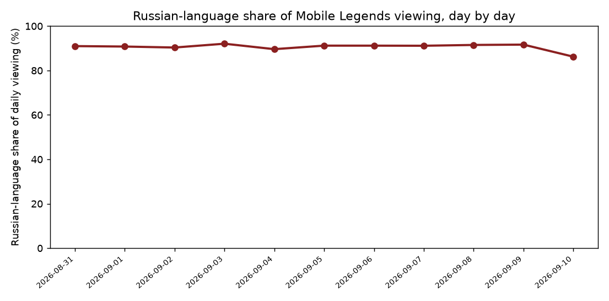
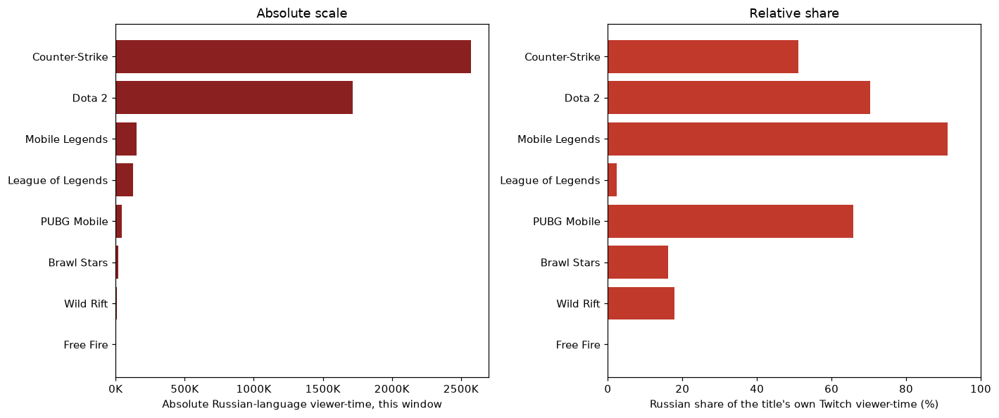
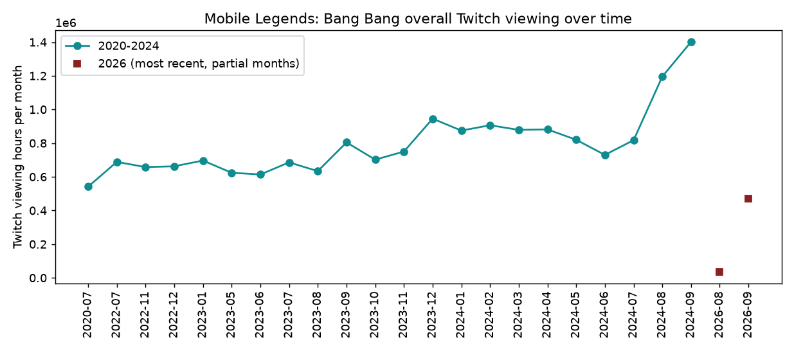

## Executive summary

Mobile Legends: Bang Bang shows an unusually large Russian-speaking creator community on Twitch — over half of its audience and creator base, far above what its publicly known competitive base (concentrated in Southeast Asia) would suggest. This report asks two separate questions about that community: is it real, and how large is it really.

<strong>Key finding.</strong> The community is real, broad-based, and backed by genuine competitive investment — not a short-lived artifact. But in absolute terms it remains modest, roughly an order of magnitude smaller than the equivalent Russian-speaking audiences already established around Counter-Strike and Dota 2.

## Is it real, or an artifact of the moment it was measured?

Three independent checks all point the same way:

- **Breadth.** 422 distinct channels stream in Russian — 53% of the title's entire creator base by channel count — with no single channel responsible for more than 9% of the total. This is a broad community, not one large broadcast skewing the picture.
- **Stability.** The Russian-language share of daily viewing held steady between 90% and 92% across every day measured (Figure 1), rather than spiking around a single event.

*Figure 1. Russian-language share of daily viewing, held essentially flat throughout the measurement window.*

- **Independent of any one tournament.** Only around one in ten Russian-language viewing hours could be tied to an active tournament broadcast; the remainder is ordinary, everyday community streaming.

## How large is it, really?

Share and absolute scale tell different stories, and both matter.

*Figure 2. Left: absolute Russian-language viewing hours by title. Right: Russian-language share of each title's own audience. Mobile Legends ranks near the top on the right and near the bottom on the left.*

Mobile Legends' Russian-speaking community is genuinely large **relative to the title's own, comparatively modest audience** — but in absolute terms it is 11 to 17 times smaller than the established Russian-speaking communities already following Counter-Strike and Dota 2. The single largest individual Mobile Legends stream observed peaked at a few thousand concurrent viewers; the equivalent peak for Counter-Strike was over eighty thousand.

## Is there real investment behind it?

Yes. A dedicated regional competitive circuit has run continuously since 2023, currently in its eighth season, with consistent five-figure prize pools. A separately sponsored series — backed by a well-known regional esports sponsor active across several other major titles — is currently in its tenth season. A one-off event held in the region in 2024 carried a seven-figure prize pool, the largest figure found in this entire investigation. This is the signature of sustained institutional investment, not incidental interest.

A second, comparable mobile title shows the same underlying pattern independently, at even larger scale, with no tournament-broadcast explanation available at all — reinforcing that this is a genuine, structural phenomenon rather than something specific to Mobile Legends or to the measurement window used here.

## Historical context

Mobile Legends' overall Twitch presence has grown substantially and consistently since 2020, more than doubling by the most recent complete year of historical data (Figure 3) — this is an active, growing title on the platform, not a fringe one.

*Figure 3. Mobile Legends' overall monthly Twitch viewing hours, all languages, 2020 to 2024.*

## Bottom line

The most accurate description of this community is a genuine, sustained, broad-based Russian-speaking following — dominant as a share of Mobile Legends' own, comparatively modest Twitch audience, but not large in absolute terms next to the platform's biggest equivalent communities. It reads as a real fragment of the platform's much larger pre-existing Russian-speaking audience engaging with this specific title, rather than evidence that Mobile Legends itself has an unusually large following there.
