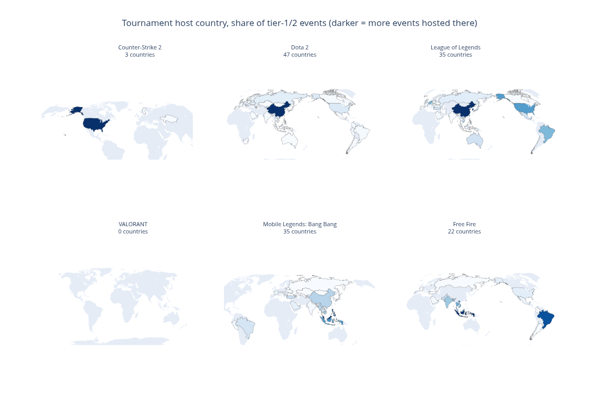
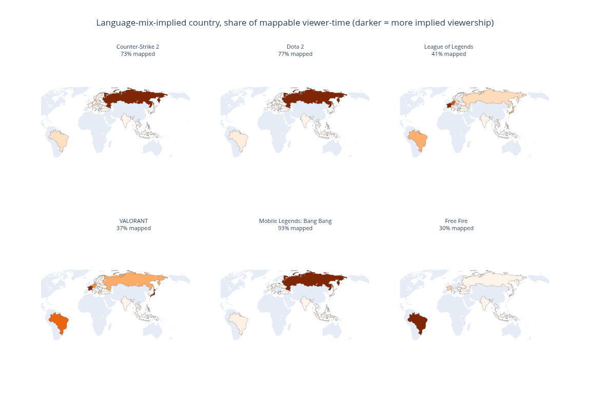

## Overview

Esports titles can be mapped geographically in two genuinely different ways: **where their tournaments are physically hosted**, and **where their audience is concentrated**, inferred from the language its viewers watch in. These two views do not agree with each other, and the disagreement is itself informative.

Six titles are compared here: Counter-Strike, Dota 2, League of Legends, VALORANT, Mobile Legends: Bang Bang, and Free Fire — chosen to span both PC and mobile esports, and both mature and newer scenes.

<strong>Key finding.</strong> Tournament host country and audience geography tell different stories for the same title. A title with a large, well-documented competitive scene can still show an almost empty map when host country is used, simply because its organizers label events by region rather than by city — this is an artifact of how tournaments are recorded, not a sign of a thin scene.

## Where tournaments are hosted

*Figure 1. Share of major tournaments hosted in each country, darker shading indicating a larger share. Titles with very few distinct countries shown recorded most events under a broader region rather than a specific host country.*

Dota 2, League of Legends, and Mobile Legends: Bang Bang all show broad, many-country hosting footprints, consistent with genuinely global competitive circuits. Counter-Strike and VALORANT, by contrast, show almost no shading at all — not because their scenes are small (both are among the largest tracked here by every other measure), but because their organizers overwhelmingly record events under a region ("Europe," "Americas," "World") rather than a specific host country. Roughly half of all tournament records across every title studied use a region rather than a country, which means this map should be read as "of the events that named a specific country," not as a complete picture.

## Where the audience is

*Figure 2. Share of each title's audience implied by broadcast language, mapped to the single country most confidently associated with that language. Percentages show how much of each title's total audience could be confidently mapped this way — languages spoken across many countries with no single dominant one (English, Spanish, Chinese, Arabic) are deliberately excluded rather than guessed.*

Counter-Strike and Dota 2 both show a strong, consistent concentration in Russia — a well-established pattern for both titles. Free Fire's audience maps least confidently of the six (only 30%), because its largest single audience segment speaks Spanish, a language that cannot be attributed to one country with confidence — the true picture for Free Fire is understated here, not absent. Mobile Legends: Bang Bang's map shows an unusually strong Russia concentration as well; a full, separate investigation into whether that is representative of a genuinely large community or a temporary artifact is presented in a companion report.

## Reading the two maps together

Neither map should be read in isolation. A title can look thin on the host-country map simply because of how its organizers name events, while still having a substantial, well-documented audience elsewhere. The two views answer different questions — where competition physically happens, and where the audience actually is — and a title's position on one map does not predict its position on the other.
