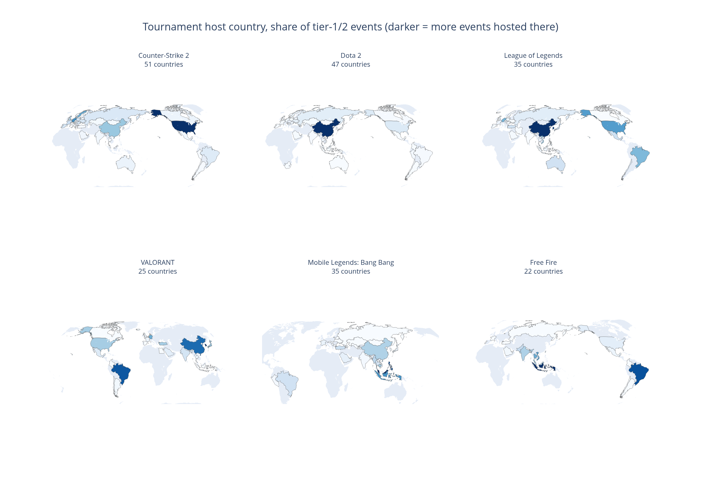
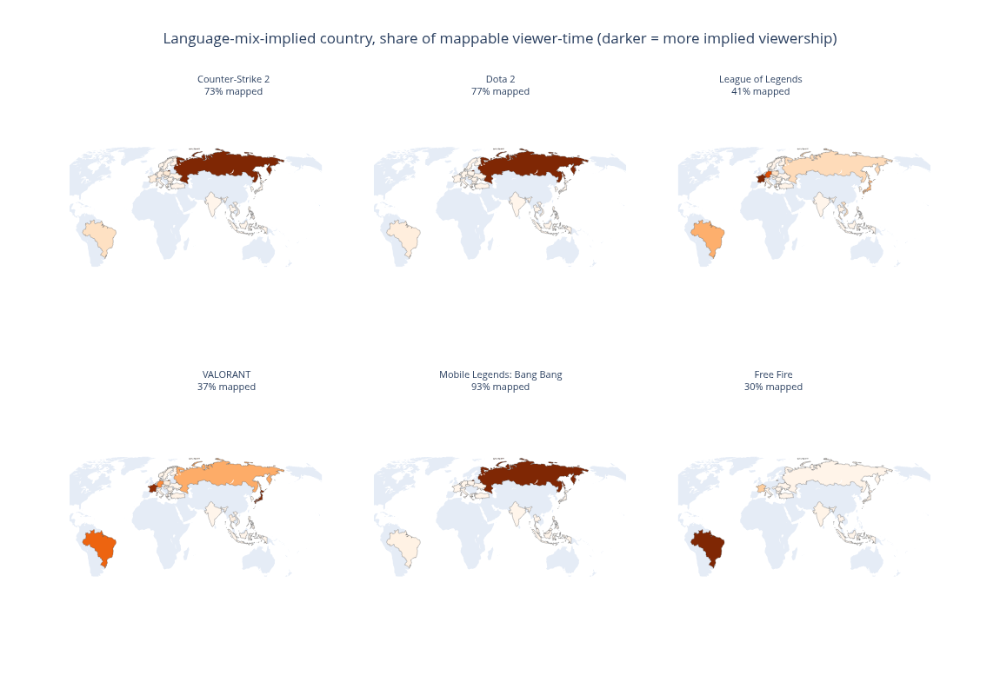

## Overview

Esports titles can be mapped geographically in two genuinely different ways: **where their tournaments are physically hosted**, and **where their audience is concentrated**, inferred from the language its viewers watch in. These two views do not agree with each other, and the disagreement is itself informative.

Six titles are compared here: Counter-Strike, Dota 2, League of Legends, VALORANT, Mobile Legends: Bang Bang, and Free Fire — chosen to span both PC and mobile esports, and both mature and newer scenes.

<strong>Key finding.</strong> All six titles show genuinely broad, many-country hosting footprints — Counter-Strike (51 countries) and VALORANT (25) included. An earlier version of this report found both looking almost empty and attributed that to organizers labeling events by region rather than by host country; that explanation didn't hold up. The real cause was a limitation in this project's original tournament-data source specifically for these two titles, now resolved by moving to a cleaner one — not a real difference in how organized or well-documented these scenes are.

## Where tournaments are hosted

*Figure 1. Share of major tournaments hosted in each country, darker shading indicating a larger share.*

All six titles show broad, many-country hosting footprints, consistent with genuinely global competitive circuits — Counter-Strike (51 distinct countries) and Dota 2 (47) lead the set, with League of Legends and Mobile Legends: Bang Bang (35 each), VALORANT (25), and Free Fire (22) all still clearly global rather than regionally concentrated. A real, smaller gap remains: across all six titles, 57.5% of major tournament records name a specific host country, with the rest recorded only under a broader region — this map reflects "of the events that named a specific country," not a complete picture, but it is not the stark near-empty result an earlier pass of this analysis found for Counter-Strike and VALORANT specifically. That earlier result came from a limitation in how this project's original tournament-data source extracted country information for those two titles, not from how their organizers actually report events.

## Where the audience is

*Figure 2. Share of each title's audience implied by broadcast language, mapped to the single country most confidently associated with that language. Percentages show how much of each title's total audience could be confidently mapped this way — languages spoken across many countries with no single dominant one (English, Spanish, Chinese, Arabic) are deliberately excluded rather than guessed.*

Counter-Strike and Dota 2 both show a strong, consistent concentration in Russia. Free Fire's audience maps least confidently of the six (only 30%), because its largest single audience segment speaks Spanish, a language that cannot be attributed to one country with confidence — the true picture for Free Fire is understated here, not absent. Mobile Legends: Bang Bang's map shows an unusually strong Russia concentration as well; a full, separate investigation into whether that is representative of a genuinely large community or a temporary artifact is presented in a companion report.

## Reading the two maps together

Neither map should be read in isolation. Where competition is physically hosted and where a title's audience actually is answer genuinely different questions, and a title's position on one map does not predict its position on the other — Counter-Strike and Dota 2's audiences concentrate heavily in Russia (Figure 2) despite both having broad, globally-distributed hosting footprints (Figure 1).

## Sources

- **Tournament host countries.** [Liquipedia](https://liquipedia.net/) — an independent, community-maintained esports wiki, used here under its CC BY-SA license, via its structured LPDB data API — covering major events across all six titles and the country (or broader region, where that is all the organizer recorded) each was hosted in.
- **Audience language and viewership.** Twitch's own public API, polled repeatedly over time to record broadcast language alongside concurrent viewers for each title, then mapped to the single country most confidently associated with each language.
